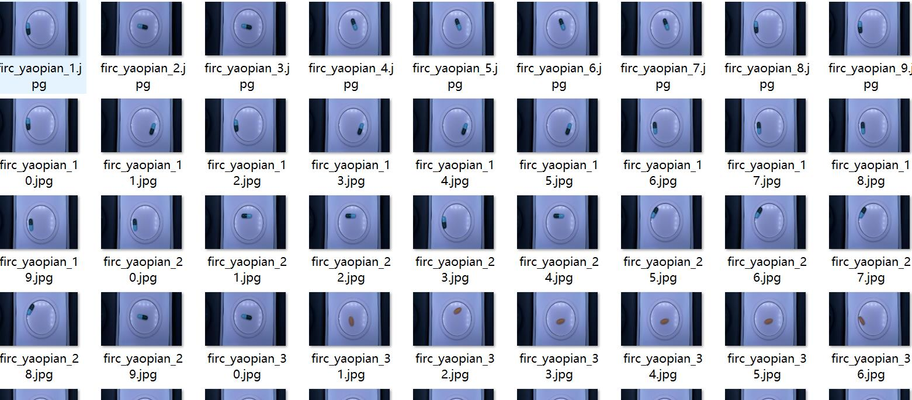
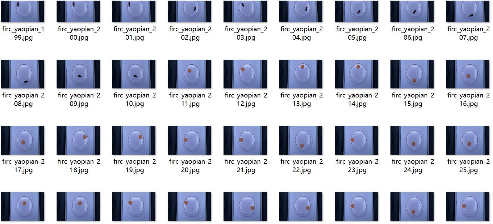
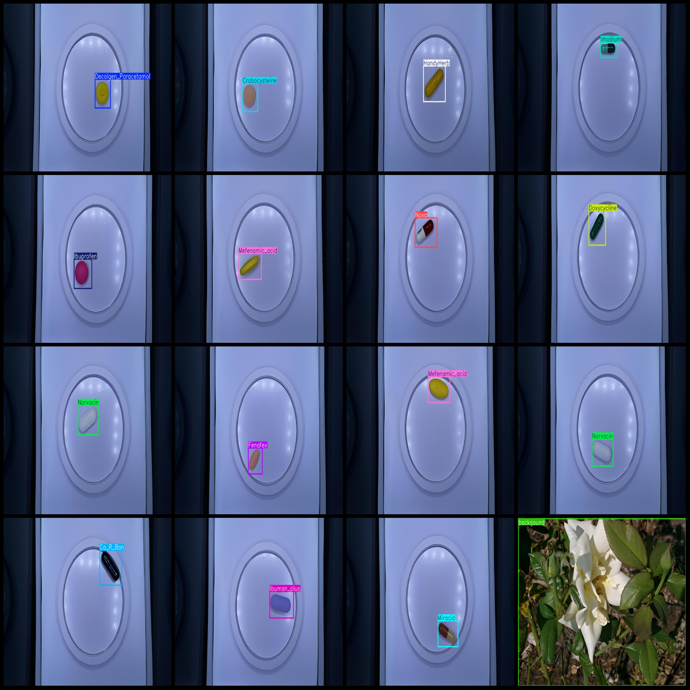
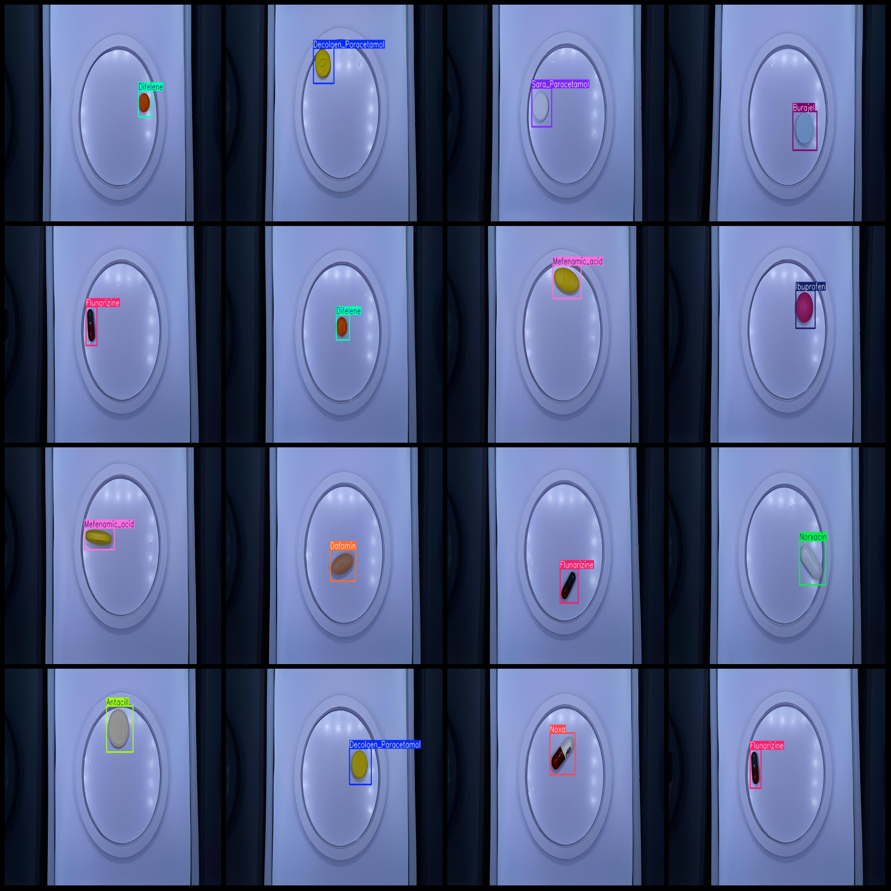

# Medical Drug Detection Dataset with VOC + YOLO format and 930 images in 31 classes

```
# Intelligent Medical Drug Detection Data Set - VOC+YOLO Format: 930 Images with 31 Categories

number of images: 930  
annotation count: 930  
annotation count: 930  
annotationnumber of classes: 31  
["Amoxicillin", "Antacill", "Burajel", "Ca_R_Bon", "Celebrex", "Centrum_Multivitamin", "Cetrizin", "Chlorpheniramine", "Crabocysteine", "Dafomin"]
"Decolgen_Paracetamol","Difelene","Doxycycline","Fenafex","Flunarizine","Gaszym","Glutamax","HandyHerb","Heromycin","Ibuman_plus","Ibuprofen","Imodium","Lamotrigine","Mefenamic_acid","Miracid",
"Norxacin","Noxa","Sara_Paracetamol","Simvastatin","Volta","background"]  
boxes per class:   
Amoxicillin box count = 31  
Antacill box count = 30  
Burajel box count = 30  
Ca_R_Bon box count = 30  
Celebrex box count = 30  
Centrum_Multivitamin box count = 30  
Cetrizin box count = 29  
Chlorpheniramine box count = 30  
Crabocysteine box count = 30  
Dafomin box count = 30  
Decolgen_Paracetamol box count = 30  
Difelene box count = 30  
Doxycycline box count = 30  
Fenafex box count = 30  
Flunarizine box count = 30  
Gaszym box count = 30  
Glutamax box count = 30  
HandyHerb box count = 30  
Heromycin box count = 29  
Ibuman_plus box count = 29  
Ibuprofen box count = 30  
Imodium box count = 30  
Lamotrigine box count = 30  
Mefenamic_acid box count = 30  
Miracid box count = 30  
Norxacin box count = 30  
Noxa box count = 30  
Sara_Paracetamol box count = 30  
Simvastatin box count = 30  
Volta box count = 31  
background box count = 31  
total boxes: 930  
images per class:   
## Images






Here is a pay link on Stripe ( https://buy.stripe.com/3cs8yP7sY87d0vu9AB ). Please contact me lonlonago@foxmail.com after funding $89, and I will send you a complete data files , thank you!


